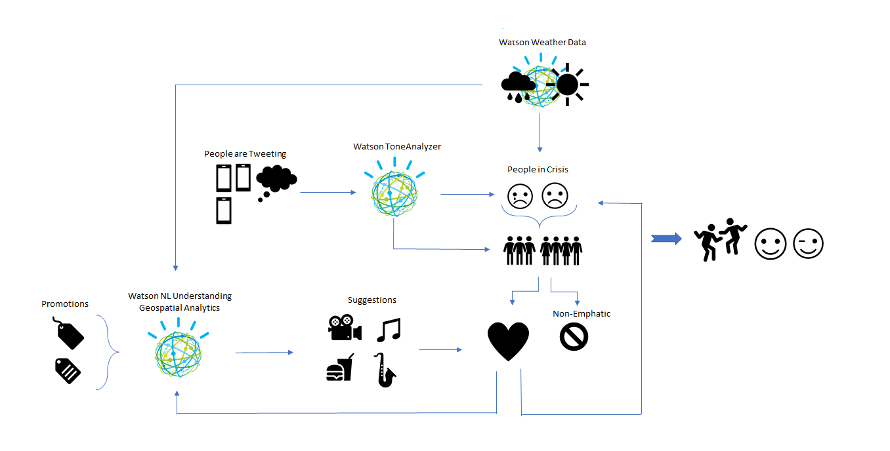

# Zephyr

##### Zephyr is the name of a therapy dog who brings affection and comfort to people during difficult times. This app uses the IBM Watson and DSX tools to identify people suffering from depression, seasonal affective disorder, or suicidal thoughts by monitoring the weather and the sentiment of their online posts. The app connects those in need with caring friends from their network and weather-appropriate activities to raise everyone's spirits.

##### Figure 1: Architecture of app.
 

##### Figure 2: Ben Affleck's sadness.
 

##### Figure 3: Email to connect depressed user with a friend and an activity promoted by a local business. 
 

